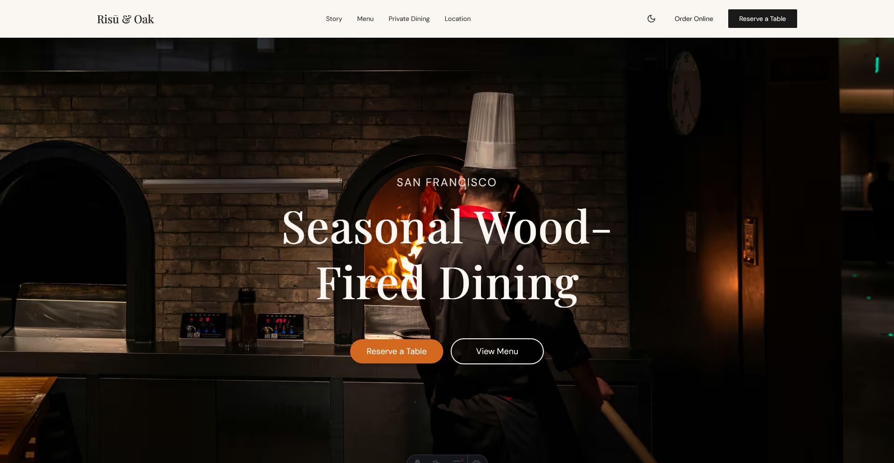

# Osteria Bellavista

Multilingual restaurant website for Osteria Bellavista, Bissone (Lake Lugano). Italian and English pages, menu, reservations, gallery, events.

Built with Astro 5, React 19, Tailwind CSS 4, i18next, and Playwright for e2e tests.



## Run locally

```bash
bun install && bun dev
# or
npm install && npm run dev
```

Build: `bun run build`

## Structure

```
src/
├── components/   Astro + React components
├── data/         Restaurant content (JSON)
├── layouts/      Page layouts
├── lib/          i18n, analytics, utilities
├── locales/      IT / EN translations
├── pages/        Astro routes
└── styles/       Global CSS
```
